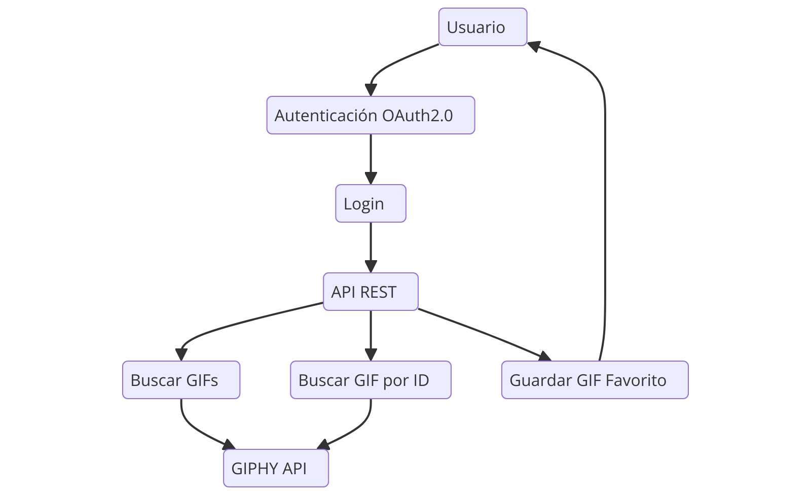
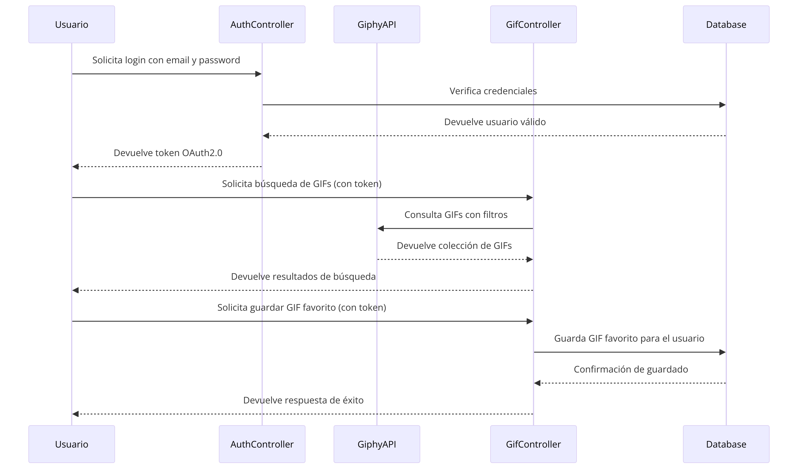
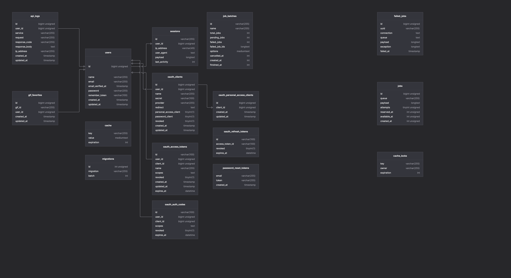

# 🎉 PREX Giphy Challenge

## 🚀 Project Description

This project is a **REST API** built with **Laravel 11** that retrieves GIFs using the **Giphy API**. Explore fun and engaging GIF content with seamless integration!

---

## 🛠️ Initialize the Project

Follow these steps to set up and run the project:

1. **Install Composer dependencies:**
   ```bash
   composer install
   ```

2. **Copy the environment configuration file:**
   ```bash
   cp .env.example .env
   ```

   Then, create the environment variables for:

   ```bash
    GIPHY_API_KEY=<giphy_api_key>
    GIPHY_BASE_URL=https://api.giphy.com/

    PASSPORT_PERSONAL_ACCESS_CLIENT_ID=<client_id>
    PASSPORT_PERSONAL_ACCESS_CLIENT_SECRET=<client_secret>
    ```

3. **Install Laravel Sail (Docker-based local development):**
   ```bash
   php artisan sail:install
   ```

4. **Start the project:**
   ```bash
   ./vendor/bin/sail up -d
   ```

5. **Generate the application key:**
   ```bash
   ./vendor/bin/sail artisan key:generate
   ```
6. **Create passport client credentials to replace into the env configuration listed above ⬆️**

    ```bash
    ./vendor/bin/sail artisan passport:client --client
    ```
7. **Generate the passport Keys**  

   ```bash
   ./vendor/bin/sail artisan passport:keys
   ```

8. **Register :D**


---

## 📌 Available Endpoints

| **Endpoint**                | **Description**                   |
|-----------------------------|-----------------------------------|
| `/api/register`             | Register a new user               |
| `/api/login`                | Login and get an access token     |
| `/api/logout`               | Logout and revoke the token       |
| `/api/gifs/search?`         | Search gifs with query string     |
| `/api/gifs/{id}`            | Search gifs by id                 |
| `/api/gifs/{id}/favorite`   | Add Gif to favorite table         |

Additionally, all details related to the project's endpoints can be found at [this postman collection](https://documenter.getpostman.com/view/7945247/2sAYHzH436).

---

**Use cases:**



---

**Sequence Diagram:**



---

**ERD**

